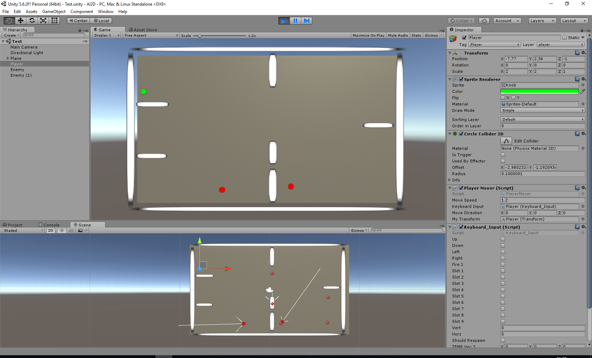

# AI2D (artificial intelligence)

Realize movement with artificial intelligence (further opponent).

Main tasks:
1) Realize the game on primitive objects, the basic logic of artificial intelligence:
�- the player: a green circle
�- opponent: red circle
2) There are boundaries of the playing field for which the opponent can not go out
3) An enemy can be in two permanent states: "search" (random motion), "patrolling" (movement in a given path)
4) The opponent has a distance to which he sees the player, if at this distance he changes the state to: "persecution" (player)
5) If the player is lost (out of a distance vision) to change to the default state: "search", "patrolling"
6) Realize without Navesh Unity
7) Control the player with the keys: left, right, top, bottom

Additionally:
1) Add to the scene obstacles that opponents must overcome and which block the player:
�- static (walls)
�- denamic (moving walls)
2) Different speeds for different enemy states: "search", "patrolling", "pursuing"

Unity 5.6.2

